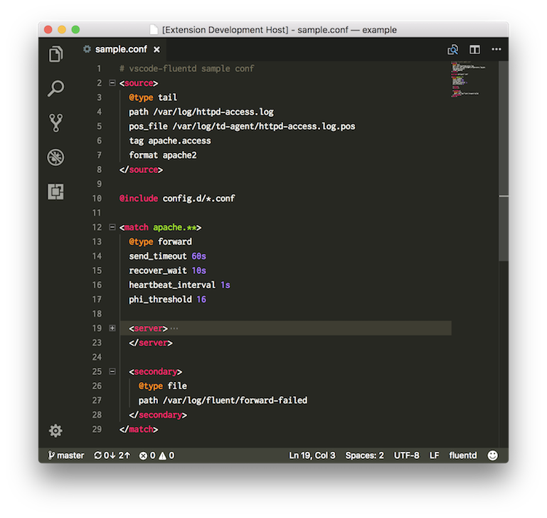

# vscode-fluentd

This extension adds language support for the fluentd configuration file to Visual Studio Code.

## Features

* Syntax highlighting

## Release Notes
## 0.0.4
- Unsupport string ([#3](https://github.com/msysyamamoto/vscode-fluentd/issues/3))

## 0.0.3
- Fixed scopeName ([#1](https://github.com/msysyamamoto/vscode-fluentd/issues/1))

### 0.0.2
* Fix scopeName in package.json

### 0.0.1
* Initial release
